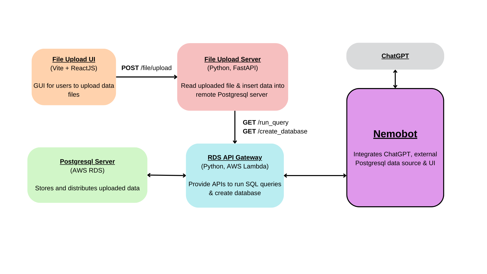
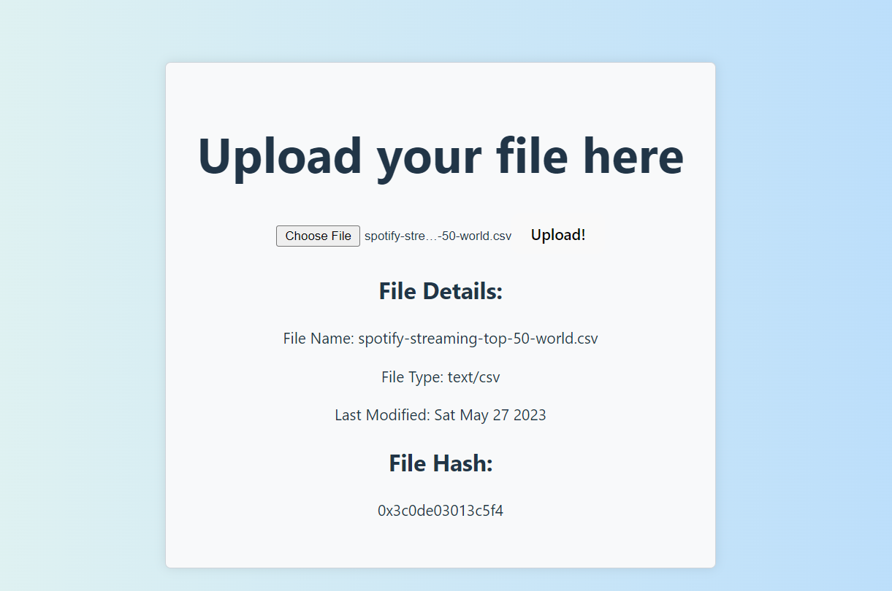
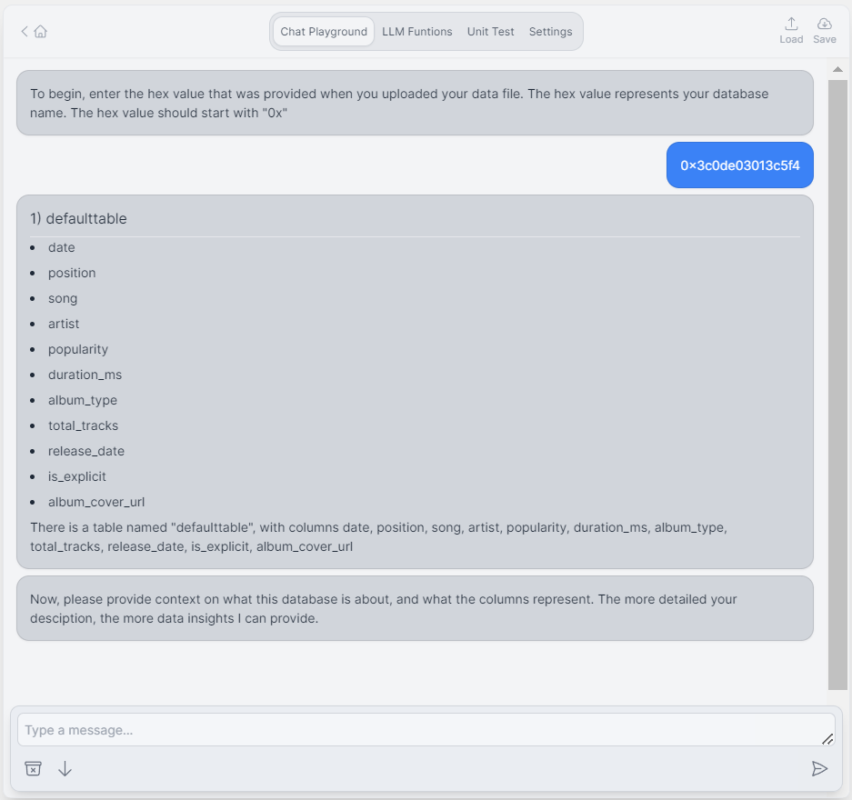
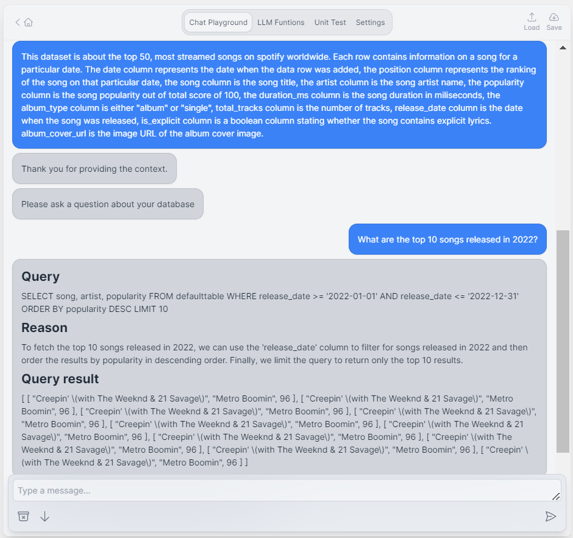

# NTU_Hackathon
# Contributors
- Wee Hung
- Augustine
- Da Jie
# Aim of the Project
Our project aims to speed up data analysis by enabling data analysts to extract valuable insights using natural language. Through the interaction with NemoBot, analysts can now interact with data intuitively, streamlining the analysis process and increasing overall efficiency. 
# High Level Design of the Project

# User Flow
1. Upload data through the File Upload UI. A hash value is returned, representing the database. 
2. Input the hash value to the bot. The bot calls an external API to query for the database’s table schemas & displays to the user.
3. The bot asks for user to explain the database to set the context.
4. User then asks a question related to the database. E.g., "How is PLN doing in relation to the rest of the market in the past year?", Nemo Bot transforms this question into an SQL query, sends it to our external API to run it against the remote database server. The query is executed and data is returned to the user.
# File Upload

- Upload the file and obtain the hash value
# Interacting with Nemobot

- Provide the hash value to load the database in the chat
#  Getting the results

- Aftering providing the context, ask the bot your question and Nemobot will convert the question to SQL query. Obtain the query result from Nemobot.
